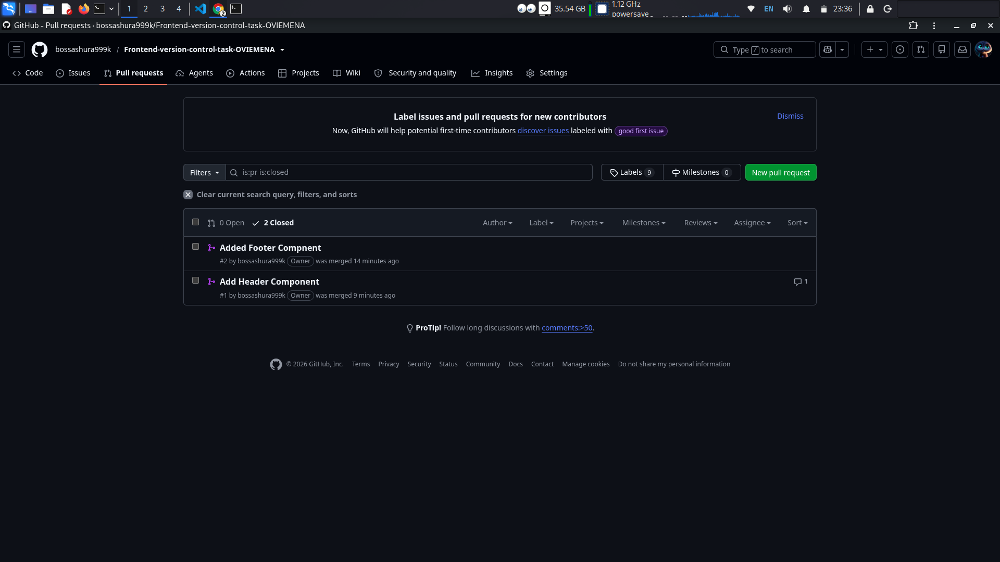

# Frontend Version Control Task

A practice repository for demonstrating Git and GitHub collaboration workflows —
branching, committing, pull requests, code review, merging, reverting, and
branch management — as part of the FlexiSAF frontend internship.
Yours Faithfully,
Israel Obire (BE)

## Branches
- feature-header: adds header component description (logo, nav, search bar)
- feature-site-footer (originally feature-footer): adds footer component 
  description (copyright, social links, site map)

## Merged Pull Requests

## Frequently Used Git Commands
- git checkout -b <branch>   - create and switch to a new branch
- git add / git commit -m    - stage and save changes
- git push -u origin <branch> - push a branch and start tracking it
- git revert <hash>          - safely undo a commit with a new commit
- git branch -m <old> <new>  - rename a branch locally
- git fetch                  - download remote changes without merging
- git pull                   - download AND merge remote changes

## Lessons Learned
(your own 2-4 sentences here)